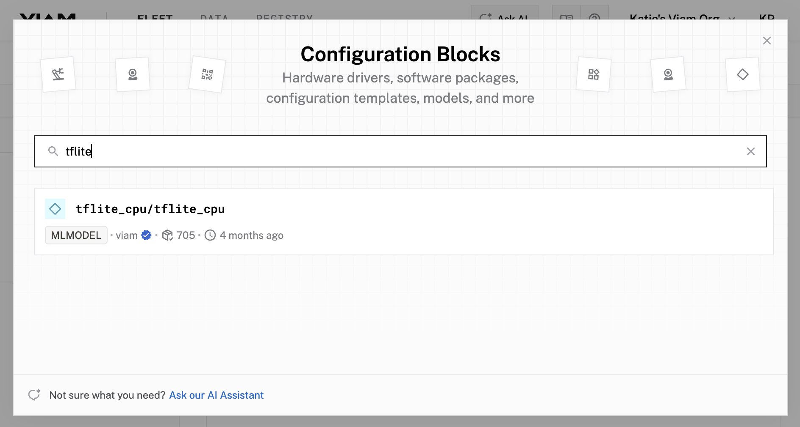
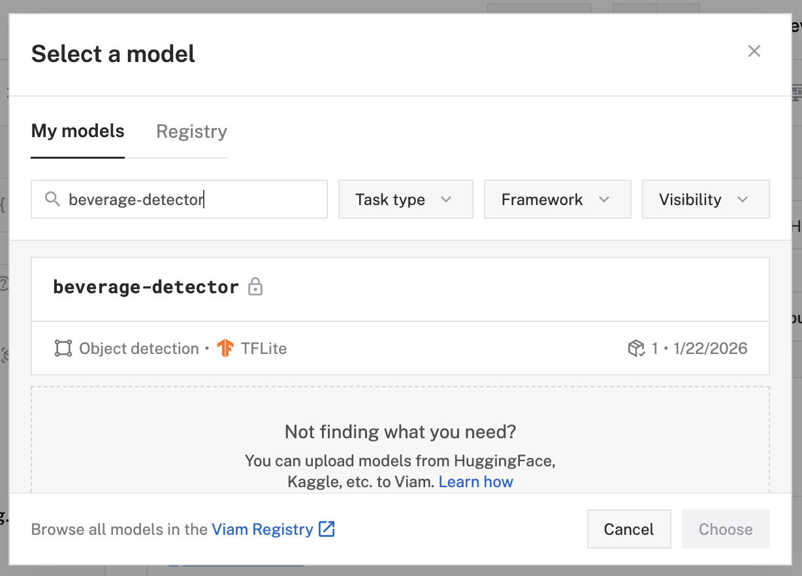

# Step 10: Configure your ML model

1. Navigate back to your [FLEET](https://app.viam.com/fleet/locations), and click on your rover. Find the **CONFIGURE** tab. 
1. Click the **+** icon in the left-hand menu and select **Configuration block**.
1. Search for `tflite`, and select the `tflite_cpu/tflite_cpu` component. Click **Add component**. Leave the default name `mlmodel-1` for now, then click **Add component**. This adds support for running TensorFlow Lite models on resource-constrained devices.
   
1. Notice adding this component adds the ML Model service called `mlmodel-1` and the `tflite_cpu` module from the Viam registry. You'll see configurable cards on the right and the corresponding parts listed in the left sidebar.
1. In the **Configure** panel of the `mlmodel-1` service, leave the default deployment selection of **Deploy model on machine**. In the **Model** section, click **Select model**.
1. Find and select the custom model you've just trained, for example `beverage-detector`. Notice that you can select from any custom models you create (located within the _My models_ tab) or from the Viam registry (located within the _Registry_ tab). Click **Choose**
    
   
1. Confirm that the correct model is selected, then click **Choose**
1. Click **Save** in the top right to save and apply your configuration changes.
1. Your custom model is now configured and will be used by the ML model service. Notice that a **Version** option is also configurable. If you decide to train new versions of your  model, you have the ability to set your machine to use a specific version based on your needs.
