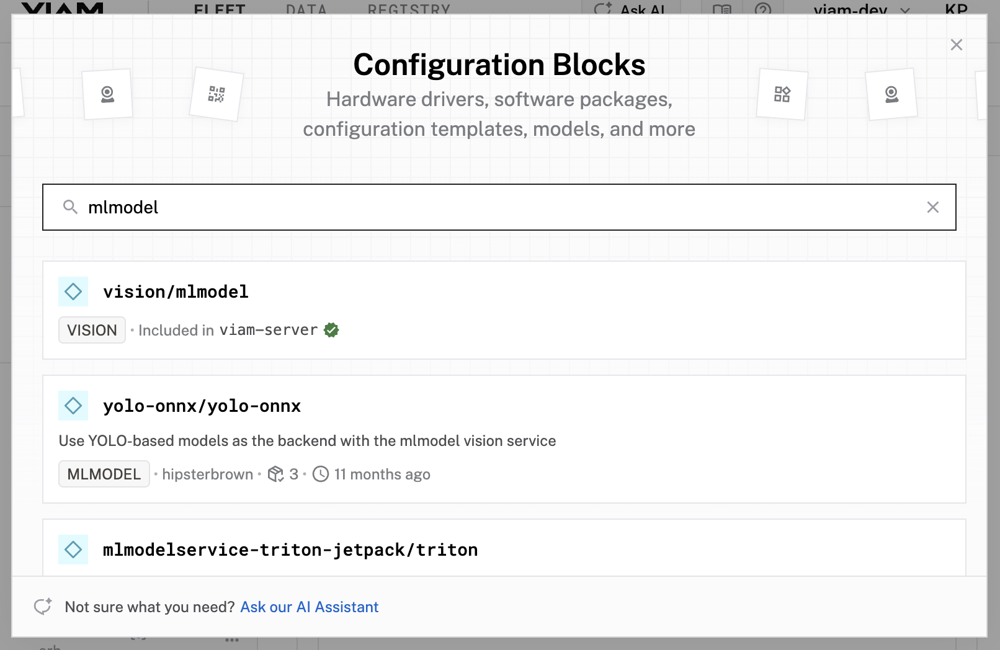
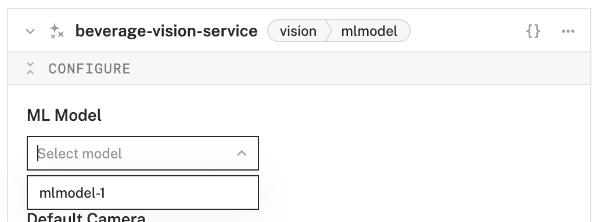
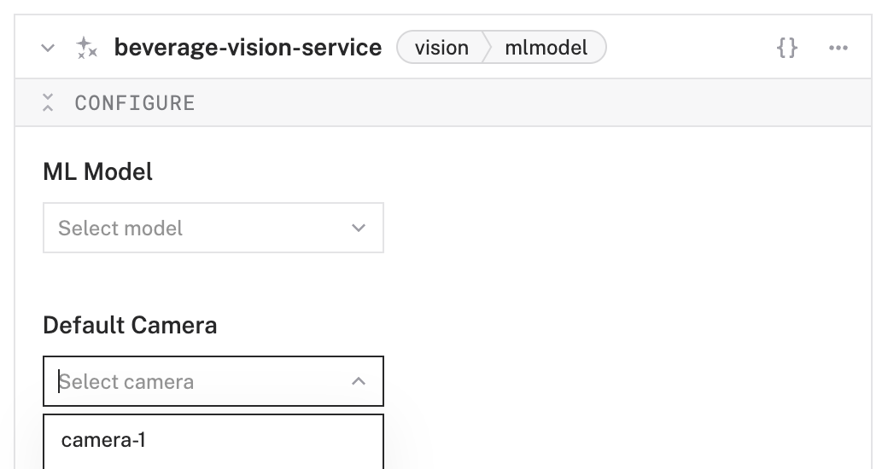
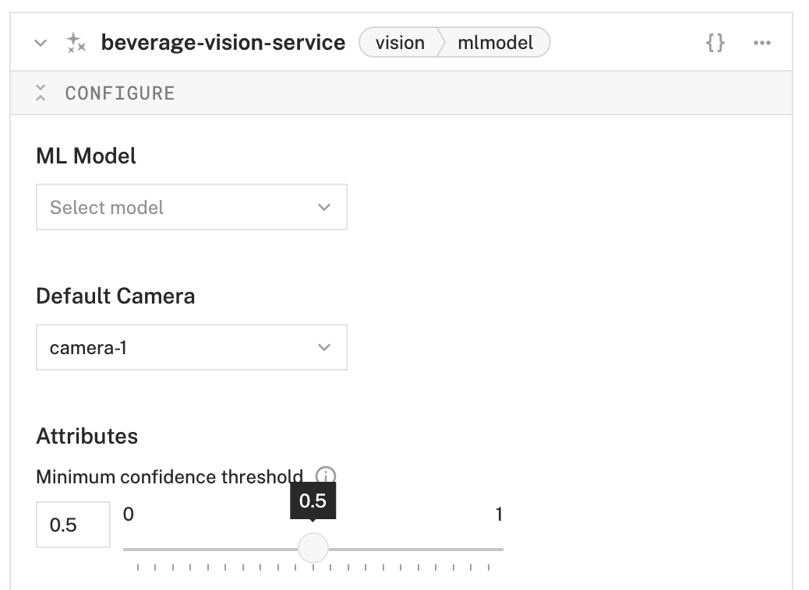

# Step 11: Add a vision service to your rover

1. Click the **+** icon in the left-hand menu.
1. Search for `mlmodel`, and find the `vision/mlmodel` module. Give your vision service a more descriptive name, for example `beverage-vision-service`. Click **Add component**. While the camera component lets you _access_ what your machine sees, the vision service _interprets_ the image data using your ML model.
    
   
1. Notice that your service is now listed in the left sidebar and a corresponding configuration card is added on the right. 
1. In the **Configure** panel of your vision service, set the **ML Model** to your ML Model service, for example `mlmodel-1`
   
1. Find and select your camera component in the **Default camera** section, for example `camera-1`.
   
1. Move the **Minimum confidence threshold** slider to `0.5`. This sets the vision service to only show results where its detection confidence level is at least 50% or higher.
   
1. Click **Save** in the top right to save and apply your configuration changes. This might take a few moments.
1. Expand the **TEST** panel of your vision service. You'll see a live feed of your configured webcam and a section of **Labels**. Test out your Rover's new object detection capabilities! Try moving your rover to get an object within it's camera's view. When detected, an bounding box will appear around the object the vision service thinks it is seeing along with its confidence level. You can also try showing multiple objects and see how well your model detects them!

   > **Troubleshooting**: Having trouble detecting the correct object (or anything at all)? Try setting the **Minimum confidence threshold** to something smaller, save your changes, and see if that helps. Additionally, make sure you have enough light for your webcam to detect clearer images, keep your background and surroundings free of potential visual clutter, and hold up your object for at least a few seconds (so that the vision service can get a clear image to interpret). If this all still doesn't work, you may need to add more images or better quality images to your model. Luckily, you can repeat the steps in **Capture images for training**, train a new version of your model, then try using it in your ML model service. The more data the better, so at the very least, more images of your beverages _should_ make your model a bit better.

Congratulations! You've just created a custom vision model and deployed it onto the Viam Rover to use! Inference is done on the Pi and your Rover now has object detection capabilities.